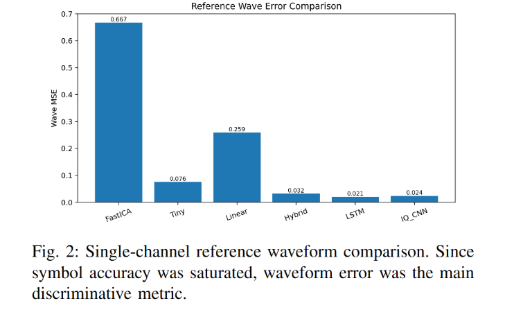

Can you write about the training we did, specify the parameters for each model. I still want to include our cross-validation run from before in the report but relate it to the 4-Channel separation problem. Write about all the training we did to compare the models, including the number of training examples, and extra stuff we did for demucs. Include plots and details related to training in our alpha and noise sweeps in the training section. But include all the details of our experiments and results in the A. Single-Channel Separation Problem. In the single channel separation problem write the conclusions for why there would be an increase in error with alpha value of 1.0. In the report don't mention anything about "Isolated experiments" we are just experimenting with the problem. I also don't want to overload the main portion of the report with graphs and images, but we should include the most interesting(ones that give the most insight into the problem) plots for the experiments in the paper and organize a section in the appendix we can reference and put in a lot more of the interesting plots with their descriptions. 

I want to include an image kind of like the below image but only with hybrid, lstm, iq_cnn and demucs results. 
![[Pasted image 20260413235251.png]] 

Two channel experiment, include the image for Single vs Two Channel Validation. If you can't find the original image you can recreate one based on the values in the image provided.
![[Pasted image 20260413234610.png]]
![[Pasted image 20260413234802.png]]
![[Pasted image 20260413235031.png]]

What to include in report:
- In training section Reference demucs growth pattern of learning slower than other models and slowly overfitting to the training data the more it trains, and indicate that that is why it is not included in the sweep experiments.
- Part of alpha sweep table that shows interesting points
- Images from alpha sweep (It would be nice if we could take off parameter labels under the title except we should put num epochs somewhere, if you can do this without rerunning experiments. I can edit image a bit if needed.)
	- ![[Pasted image 20260414064117.png]]
	- ![[Pasted image 20260414064146.png]]
	- Perfect wave reconstruction graph for IQ_CNN, explain that the results are the same for all except demucs![[Pasted image 20260414064604.png]]
	- Failure point wave reconstruction. ![[Pasted image 20260414064732.png]]

What to include in the appendix:
- Demucs Plots![[Pasted image 20260414063341.png]]![[Pasted image 20260414063417.png]]
- Full alpha sweep table
- ![[Pasted image 20260414064442.png]]
- Plots for perfect wave construction for other models, along with demucs imperfect reconstruction.
- ![[Pasted image 20260414064922.png]]
- Other interesting plots.

